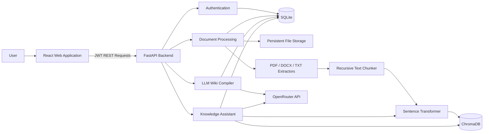

# Enterprise AI Knowledge Assistant

<p align="left">


</p>

A full-stack AI platform that transforms uploaded documents into a structured internal Wiki and provides grounded answers with traceable citations.

The application combines document processing, multilingual semantic retrieval, generative AI, authentication, persistent storage, and a modern React interface in a complete end-to-end workflow.

## Live Demo

**Frontend:**  
https://enterprise-ai-knowledge.vercel.app

**GitHub Repository:**  
https://github.com/AfroditiTzama/Enterprise-AI_Knowledge

> The frontend is deployed on Vercel.  
> The complete AI pipeline can be run locally. Free cloud instances may not provide enough memory to load the Sentence Transformer model together with FastAPI, PyTorch, and ChromaDB reliably.

---

## Overview

The Enterprise AI Knowledge Assistant allows authenticated users to:

1. Upload PDF, DOCX, and TXT documents.
2. Extract and clean their textual content.
3. Divide the extracted content into overlapping chunks.
4. Generate semantic embeddings for every chunk.
5. Store vectors and document metadata persistently.
6. Transform each document into an LLM-generated internal Wiki.
7. Browse and search structured Wiki pages.
8. Ask questions across both the generated Wiki and original document chunks.
9. Receive grounded answers with citations and traceable sources.

This project is not implemented as a simple RAG chatbot.

In addition to document retrieval, it introduces a persistent **LLM Wiki layer** that organizes unstructured document content into structured pages, summaries, sources, and internal links.

---

## Key Features

### Authentication and Security

- User registration and login
- Argon2 password hashing
- JWT Bearer authentication
- Protected API endpoints
- User-specific documents and Wiki pages
- Owner-based retrieval filtering
- Environment-based secret management
- Protection against storage path traversal

### Document Management

- Upload PDF, DOCX, and TXT files
- Persistent document metadata
- Document processing status
- File type and size tracking
- User-isolated document access

### Text Extraction

- PDF extraction using `pypdf`
- DOCX extraction using `python-docx`
- Paragraph and table extraction
- TXT decoding with multiple encoding fallbacks
- Page-level metadata where available
- Unicode cleaning before LLM requests

### Text Chunking

- Recursive text splitting
- Configurable chunk size
- Configurable chunk overlap
- Preservation of page numbers
- Persistent chunk storage in SQLite

### Embeddings and Vector Search

- Multilingual Sentence Transformer embeddings
- Normalized semantic vectors
- Persistent ChromaDB collection
- Cosine similarity search
- User-based vector filtering
- Traceable chunk metadata

### LLM Wiki Generation

- Document-to-Wiki compilation
- OpenRouter LLM integration
- Structured Wiki pages
- Wiki page titles
- Page summaries
- Markdown content
- Wiki source associations
- Internal Wiki links
- Persistent storage in SQLite

### Knowledge Assistant

- Retrieval from original document chunks
- Retrieval from generated Wiki pages
- Hybrid knowledge context
- Grounded LLM answers
- Inline citations such as `[S1]`
- Source identifiers
- Similarity scores
- Page and chunk metadata
- Markdown response rendering

### Frontend

- React and TypeScript
- Vite
- Responsive dark interface
- Login and registration
- Protected routes
- Document dashboard
- Upload and processing controls
- Wiki browser
- Wiki search
- Knowledge Assistant chat
- Loading states
- Success and error messages
- Vercel SPA routing

---

## System Architecture



---

## End-to-End Workflow

```text
User registration or login
        ↓
JWT access token
        ↓
Document upload
        ↓
Persistent file and metadata storage
        ↓
PDF, DOCX, or TXT text extraction
        ↓
Recursive overlapping chunk creation
        ↓
Sentence Transformer embedding generation
        ↓
SQLite chunk persistence
        ↓
ChromaDB vector persistence
        ↓
LLM Wiki compilation
        ↓
Wiki page, source, and link persistence
        ↓
Hybrid Wiki and document retrieval
        ↓
Grounded answer generation
        ↓
Answer with traceable citations
```

---

## Technology Stack

### Backend

- Python 3.12
- FastAPI
- Pydantic v2
- SQLAlchemy Async
- Alembic
- SQLite
- Aiosqlite
- JWT
- Argon2
- HTTPX

### Artificial Intelligence

- Sentence Transformers
- PyTorch
- OpenRouter API
- Gemini through OpenRouter
- Multilingual semantic embeddings
- Retrieval-Augmented Generation
- LLM-generated Wiki compilation
- Prompt engineering

### Vector Storage

- ChromaDB
- Persistent vector collections
- Cosine similarity retrieval
- Metadata filtering

### Document Processing

- pypdf
- python-docx
- PDF page extraction
- DOCX paragraph and table extraction
- TXT encoding fallbacks
- Recursive text chunking

### Frontend

- React
- TypeScript
- Vite
- Axios
- React Router
- React Markdown
- Lucide React
- CSS

### Infrastructure

- Docker
- Railway
- Vercel
- GitHub
- Persistent filesystem storage

---

## Project Structure

```text
Enterprise-AI_Knowledge/
├── apps/
│   ├── api/
│   │   ├── migrations/
│   │   │   └── versions/
│   │   ├── scripts/
│   │   ├── src/
│   │   │   └── knowledge_assistant/
│   │   │       ├── application/
│   │   │       │   ├── auth/
│   │   │       │   ├── chat/
│   │   │       │   ├── documents/
│   │   │       │   └── wiki/
│   │   │       ├── bootstrap/
│   │   │       │   └── dependencies/
│   │   │       ├── core/
│   │   │       ├── domain/
│   │   │       │   ├── embeddings/
│   │   │       │   ├── users/
│   │   │       │   ├── documents/
│   │   │       │   ├── vector_store/
│   │   │       │   └── wiki/
│   │   │       ├── infrastructure/
│   │   │       │   ├── database/
│   │   │       │   ├── documents/
│   │   │       │   ├── embeddings/
│   │   │       │   ├── security/
│   │   │       │   ├── storage/
│   │   │       │   ├── vector_store/
│   │   │       │   └── wiki/
│   │   │       ├── presentation/
│   │   │       │   └── api/
│   │   │       └── main.py
│   │   ├── tests/
│   │   ├── Dockerfile
│   │   ├── .dockerignore
│   │   ├── alembic.ini
│   │   └── pyproject.toml
│   │
│   └── web/
│       ├── public/
│       ├── src/
│       │   ├── api/
│       │   ├── components/
│       │   ├── pages/
│       │   ├── App.tsx
│       │   ├── index.css
│       │   └── main.tsx
│       ├── package.json
│       ├── vercel.json
│       └── vite.config.ts
│
├── docs/
├── docker-compose.yml
├── Makefile
├── .gitignore
└── README.md
```

---

## Backend Architecture

The backend follows **Clean Architecture** and **Domain-Driven Design** principles.

### Domain Layer

The domain layer contains the core business entities and abstractions.

Examples include:

- User
- Document
- Document status
- Document chunk
- Wiki page
- Wiki page source
- Wiki page link
- Repository interfaces
- File storage interface
- Text extractor interface
- Text chunker interface
- Embedding service interface
- Vector store interface

The domain layer does not depend on FastAPI, SQLAlchemy, ChromaDB, or OpenRouter.

### Application Layer

The application layer contains use cases and orchestration logic.

Examples include:

- Register user
- Authenticate user
- Upload document
- List user documents
- Process document
- Extract text
- Generate chunks
- Generate embeddings
- Persist vector records
- Compile document Wiki
- List Wiki pages
- Retrieve a Wiki page
- Ask the Knowledge Assistant

### Infrastructure Layer

The infrastructure layer contains technical implementations.

Examples include:

- SQLAlchemy database models
- SQLAlchemy repositories
- SQLite database configuration
- Alembic migrations
- Local file storage
- PDF extractor
- DOCX extractor
- TXT extractor
- Recursive text chunker
- Sentence Transformer embedding service
- ChromaDB vector store
- OpenRouter Wiki compiler
- OpenRouter answer generator
- JWT implementation
- Argon2 password hashing

### Presentation Layer

The presentation layer contains:

- FastAPI routers
- Request schemas
- Response schemas
- Authentication dependencies
- API exception handling
- HTTP status management

### Bootstrap Layer

The bootstrap layer connects interfaces to concrete infrastructure implementations through FastAPI dependency injection.

---

## API Endpoints

### Authentication

```http
POST /auth/register
POST /auth/login
GET  /auth/me
```

### Documents

```http
POST /documents
GET  /documents
POST /documents/{document_id}/process
```

### Wiki

```http
POST /wiki/documents/{document_id}/compile
GET  /wiki/pages
GET  /wiki/pages/{slug}
```

### Knowledge Assistant

```http
POST /chat/ask
```

Interactive API documentation is available locally at:

```text
http://127.0.0.1:8000/docs
```

---

## Example Workflow

### 1. Register an account

Create a user account with:

- Full name
- Email
- Password

### 2. Upload a document

Supported file formats:

```text
.pdf
.docx
.txt
```

### 3. Process the document

The processing pipeline:

- Reads the uploaded file
- Extracts text
- Creates overlapping chunks
- Generates embeddings
- Stores chunks in SQLite
- Stores vectors in ChromaDB
- Marks the document as processed

### 4. Build the Wiki

The Wiki compiler:

- Reads the processed chunks
- Sends grounded context to the LLM
- Generates structured Wiki pages
- Creates titles and summaries
- Produces Markdown content
- Stores page sources and links

### 5. Ask the Assistant

The Assistant:

- Embeds the user question
- Searches document chunks
- Searches Wiki knowledge
- Builds a grounded context
- Requests an LLM-generated answer
- Returns the answer with sources and citations

---

## Local Installation

### Prerequisites

Install:

- Python 3.12
- Node.js 20 or later
- npm
- Git
- An OpenRouter API key

---

### 1. Clone the repository

```bash
git clone \
https://github.com/AfroditiTzama/Enterprise-AI_Knowledge.git

cd Enterprise-AI_Knowledge
```

---

### 2. Configure the backend

```bash
cd apps/api

python3.12 -m venv .venv

source .venv/bin/activate

python -m pip install --upgrade pip

pip install -e .
```

---

### 3. Create the backend environment file

Create:

```text
apps/api/.env
```

Example:

```env
APP_ENV=development
APP_DEBUG=true

DATABASE_URL=sqlite+aiosqlite:///./knowledge_assistant.db

DOCUMENTS_STORAGE_DIRECTORY=storage/documents
CHROMA_STORAGE_DIRECTORY=storage/chroma

JWT_SECRET_KEY=replace-with-a-secret-of-at-least-32-characters
JWT_ALGORITHM=HS256

ACCESS_TOKEN_EXPIRE_MINUTES=15
REFRESH_TOKEN_EXPIRE_DAYS=7

OPENROUTER_API_KEY=replace-with-your-openrouter-api-key
OPENROUTER_MODEL=google/gemini-2.5-flash

CORS_ORIGINS=http://localhost:5173,http://127.0.0.1:5173
```

Do not commit the `.env` file.

Generate a JWT secret with:

```bash
openssl rand -hex 32
```

---

### 4. Run database migrations

From `apps/api`:

```bash
alembic upgrade head
```

---

### 5. Start the backend

```bash
uvicorn knowledge_assistant.main:app \
  --reload \
  --host 127.0.0.1 \
  --port 8000
```

The API will be available at:

```text
http://127.0.0.1:8000
```

Swagger documentation:

```text
http://127.0.0.1:8000/docs
```

---

### 6. Configure the frontend

Open another terminal:

```bash
cd apps/web

npm install
```

Create:

```text
apps/web/.env
```

Add:

```env
VITE_API_BASE_URL=http://127.0.0.1:8000
```

---

### 7. Start the frontend

```bash
npm run dev
```

Open:

```text
http://localhost:5173
```

---

## Production Build

### Backend checks

```bash
cd apps/api

source .venv/bin/activate

python -m compileall src

alembic upgrade head
```

### Frontend build

```bash
cd apps/web

npm install

npm run build
```

The frontend production output is created in:

```text
apps/web/dist
```

---

## Docker

The backend includes a Dockerfile based on Python 3.12.

### Build the backend image

From the repository root:

```bash
docker build \
  -t enterprise-ai-knowledge-api \
  apps/api
```

### Run the container

```bash
docker run \
  --env-file apps/api/.env \
  -p 8000:8000 \
  enterprise-ai-knowledge-api
```

### Run with persistent storage

```bash
docker run \
  --env-file apps/api/.env \
  -p 8000:8000 \
  -v knowledge-ai-data:/data \
  enterprise-ai-knowledge-api
```

---

## Data Persistence

The system stores different types of application data.

| Data | Storage |
|---|---|
| Users | SQLite |
| Authentication data | SQLite |
| Document metadata | SQLite |
| Document processing status | SQLite |
| Extracted text chunks | SQLite |
| Wiki pages | SQLite |
| Wiki sources | SQLite |
| Wiki links | SQLite |
| Uploaded files | Filesystem |
| Semantic vectors | ChromaDB |

Production deployments require persistent storage for:

```text
/data/knowledge_assistant.db
/data/storage/documents
/data/storage/chroma
```

---

## Deployment

### Frontend

The React frontend is deployed on Vercel.

Production URL:

```text
https://enterprise-ai-knowledge.vercel.app
```

Vercel configuration:

```text
Root Directory: apps/web
Framework Preset: Vite
Build Command: npm run build
Output Directory: dist
```

Frontend production variable:

```env
VITE_API_BASE_URL=https://your-backend-domain
```

The project includes `vercel.json` for React Router SPA rewrites.

### Backend

The backend includes a production Dockerfile and can be deployed to any platform supporting:

- Docker
- Persistent volumes
- Environment variables
- At least approximately 2 GB of memory for the complete local embedding stack

The backend was tested with Railway deployment and persistent volume storage.

### Cloud Memory Note

The Sentence Transformer, PyTorch, ChromaDB, FastAPI, and application dependencies can exceed the memory limit of small free cloud instances.

For that reason, the complete AI pipeline is most reliable when:

- Run locally
- Deployed to a service with sufficient memory
- Or adapted to use an external embedding API

---

## Security

The project includes the following security practices:

- Argon2 password hashing
- JWT access tokens
- Protected API routes
- Owner-based document filtering
- Owner-based Wiki filtering
- Owner-based vector search
- Secrets loaded from environment variables
- No API keys in the frontend
- No secrets committed to Git
- Storage path validation
- Persistent data excluded from Git
- Uploaded files excluded from Git
- ChromaDB files excluded from Git
- SQLite database files excluded from Git
- CORS origin configuration

---

## Error Handling

The application handles:

- Invalid login credentials
- Duplicate registrations
- Unauthorized requests
- Missing documents
- Unsupported file types
- Failed text extraction
- Empty extracted documents
- Processing failures
- Embedding failures
- Vector-store failures
- Wiki compilation failures
- OpenRouter request errors
- Invalid LLM output
- Network failures
- Frontend validation errors

Documents can have one of the following statuses:

```text
UPLOADED
PROCESSING
PROCESSED
FAILED
```

---

## Current Project Status

### Completed

- Clean Architecture backend
- Domain-driven module organization
- User registration
- User login
- JWT authentication
- Argon2 password hashing
- Protected endpoints
- PDF upload
- DOCX upload
- TXT upload
- Persistent file storage
- Document metadata persistence
- PDF text extraction
- DOCX text extraction
- TXT text extraction
- Recursive text chunking
- Chunk persistence
- Multilingual embedding generation
- ChromaDB persistence
- Semantic vector search
- Document processing pipeline
- OpenRouter integration
- LLM Wiki generation
- Wiki page persistence
- Wiki source persistence
- Wiki link persistence
- Wiki listing
- Wiki page retrieval
- Wiki search interface
- Hybrid Knowledge Assistant
- Grounded answers
- Source citations
- React frontend
- Responsive layout
- Authentication interface
- Documents dashboard
- Upload interface
- Processing interface
- Wiki browser
- Assistant chat
- Docker deployment
- Vercel deployment
- Railway deployment testing
- Persistent volume support

### Portfolio Status

The project is a complete portfolio-grade MVP demonstrating:

- AI engineering
- Full-stack development
- Backend architecture
- Document intelligence
- Embedding-based retrieval
- Vector databases
- Generative AI integration
- RAG system design
- LLM-generated knowledge organization
- Authentication and security
- Docker deployment
- Cloud deployment

---

## Future Improvements

- Document deletion
- Wiki deletion
- Confirmation dialogs
- Background processing queue
- Celery or task-worker integration
- Real-time processing progress
- Persistent chat history
- Clickable inline citations
- Source preview modal
- Streaming assistant responses
- Organization workspaces
- Role-based access control
- Team invitations
- PostgreSQL production database
- External object storage
- Managed vector database
- External embedding API
- Rate limiting
- Request quotas
- Monitoring and observability
- Structured application logging
- Automated integration tests
- End-to-end frontend tests
- Retrieval evaluation metrics
- Prompt evaluation
- CI/CD security scanning
- Custom domain
- Password reset
- Email verification

---

## Engineering Concepts Demonstrated

This project demonstrates practical experience with:

- Clean Architecture
- Domain-Driven Design
- Dependency inversion
- Repository pattern
- Command and query separation
- Async Python
- REST API development
- Authentication
- Database migrations
- Vector search
- Semantic embeddings
- Retrieval-Augmented Generation
- Prompt engineering
- LLM output validation
- Document processing
- Frontend-backend integration
- Docker
- Persistent storage
- Cloud deployment
- Environment-based configuration

---

## Author

**Afroditi Xama**

Computer Science and Biomedical Informatics undergraduate focused on:

- Artificial Intelligence
- Machine Learning
- Deep Learning
- Generative AI
- Large Language Models
- RAG systems
- AI engineering
- Biomedical applications

GitHub:  
https://github.com/AfroditiTzama

---

## License

This project was developed for educational, portfolio, and demonstration purposes.
